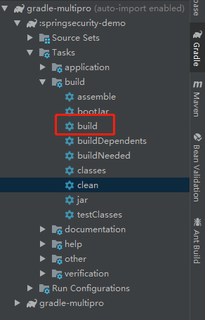
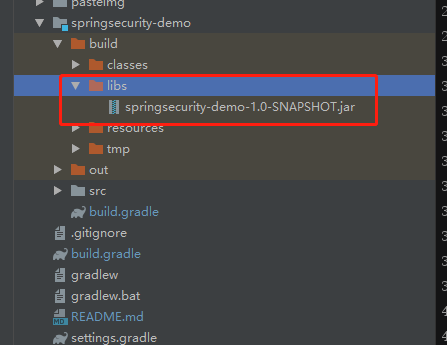

# gradle-multipro(gradle聚合工程示例)
gradle聚合工程的官方文档件见[这里](https://docs.gradle.org/current/userguide/multi_project_builds.html)
## 建立父工程目录
使用`git命令`建立父工程目录
```
mkdir gradle-multi
cd gradle-multi
gradle init
```
 


## 建立子工程
### 使用idea选中目录的`build.gradle`文件以project打开

### idea操作步骤
* step1  

* step2

* step3

* step4

### 查看`setting.gradle`
include指定包含子项目的项目名，这里使用idea建立的子项目已经自动添加进来了.如果没有添加相当于没有建立multi工程的父子关系，所以这个很重要.

```
include 'subproject1'
```

## 修改配置
在maven的multi工程中，我们需要在父工程的pom文件中指定依赖的版本号、公用依赖，如果使用了springboot或者springcloud还要指定具体的springboot和springcloud版本；在子工程还需要引入具体的依赖。gradle也是类似的。
## 修改父工程的 `build.gradle`
### 全文示例

```text
buildscript {
    /*定义环境变量*/
    ext {
        springIOVersion = '1.0.0.RELEASE'
        springBootVersion = '2.0.4.RELEASE'
    }
    /*脚本运行的依赖*/
    repositories {
        maven { url 'http://maven.aliyun.com/nexus/content/groups/public/' }
        maven { url "http://repo.spring.io/snapshot" }
        maven { url "http://repo.spring.io/milestone" }
        maven { url 'http://maven.springframework.org/release' }
        maven { url 'http://maven.springframework.org/milestone' }
    }

    /*定义依赖的springboot版本*/
    dependencies {
        classpath "io.spring.gradle:dependency-management-plugin:${springIOVersion}"
        classpath "org.springframework.boot:spring-boot-gradle-plugin:${springBootVersion}"
    }
}
//所有的工程都会执行这个task
allprojects {
    group 'com.zhouyu'
    version '1.0-SNAPSHOT'
    repositories {
        maven { url 'http://maven.aliyun.com/nexus/content/groups/public/' }
        mavenLocal()
        mavenCentral()
        jcenter()
    }

    //插件
    apply plugin: 'idea'
    apply plugin: 'java'
    apply plugin: 'org.springframework.boot'
    apply plugin: 'io.spring.dependency-management'

    sourceCompatibility = 1.8
    targetCompatibility = 1.8

    tasks.withType(JavaCompile) {
        options.encoding = 'UTF-8'
    }

    //在这里定义公用依赖
    dependencies {
        /**热部署和lombok*/
        runtimeOnly 'org.springframework.boot:spring-boot-devtools'
        annotationProcessor 'org.projectlombok:lombok:1.18.2'
        compileOnly 'org.projectlombok:lombok:1.18.2'
        testAnnotationProcessor 'org.projectlombok:lombok:1.18.2'
        testCompileOnly 'org.projectlombok:lombok:1.18.2'
        /**通用工具*/
        implementation('org.apache.commons:commons-lang3:3.8')
        implementation('com.alibaba:fastjson:1.2.47')
    }

    configurations {
        compileOnly {
            extendsFrom annotationProcessor
        }
    }
}
/**定义只有子工程才会执行的task*/
subprojects{
    
}
//在这里给具体的子工程添加自定义的task，也可以在子工程的build.gradle里面添加.
project(':subproject1') {
    dependencies {
        implementation('org.springframework.boot:spring-boot-starter-web')
//        implementation 'org.mybatis.spring.boot:mybatis-spring-boot-starter:2.0.0'
//        implementation('mysql:mysql-connector-java')
        implementation 'org.springframework.boot:spring-boot-starter-security'
        implementation('com.auth0:java-jwt:3.4.0')

        testImplementation('org.springframework.boot:spring-boot-starter-test')
        testImplementation 'org.springframework.security:spring-security-test'
    }
}

```
### 关于`subprojects` 和`allprojects`的区别
这两个功能非常相似，前者指定包括rootprorject在内都要执行的task,后者只在子工程内执行task.可以参看[这里](https://www.jianshu.com/p/84ac62747e59)
### 关于`buildscript`的repositories和`allprojects`的repositories的区别
* buildscript中的声明是gradle脚本自身需要使用的资源。可以声明的资源包括依赖项、第三方插件、maven仓库地址等,而这些插件和类库不是项目直接使用的。
* allprojects里面的依赖是项目的共同依赖，从指定的maven仓库地址获取
## 修改子工程的build.gradle
子工程的build.gradle文件修改就看你具体的子工程需要哪些了.比如docker插件，打包镜像名称都是子工程各自定义的，所以只要是子工程各自独有的依赖和插件，你都可以在这里配置；与父工程相同的会覆盖父工程的。例如我在这只是定义一下打jar包的实例，如果你在子工程修改了version和baseName那么打包出来的就是子工程修改后的。
```
/**自定义打包配置*/
jar {
    baseName = 'gradle-demo'
    version = '0.0.1'
    manifest {
        attributes "Manifest-Version": 1.0,
                'Main-Class': 'com.zhouyu.SpringSecurityDemoApplication'
    }
}
*/
/**task buildDocker(type: Docker, dependsOn: build) {

    tagVersion = "1.0.0"
    applicationName = "item"
    tag = "localhost:5000/${applicationName}"
    push = true
    dockerfile = ('../docker/Dockerfile')
    doFirst {
        copy {
            from jar
            rename { 'app.jar' }
            into stageDir
        }
    }
}*/
```
## 打包运行


## 采坑记
* gradle下lombok依赖错误，导致每次打包不了,可以参见票[这里](https://stackoverflow.com/questions/50519138/annotationprocessor-gradle-4-7-configuration-doesnt-run-lombok).大致的意思是说，gradle4.7以后默认引入lombok的方式有问题，需要改成以下
```groovy
annotationProcessor('org.projectlombok:lombok')
compileOnly('org.projectlombok:lombok')
testAnnotationProcessor('org.projectlombok:lombok')
testCompileOnly('org.projectlombok:lombok')
```
[Spring Boot、Spring Cloud版本](http://blog.didispace.com/spring-cloud-alibaba-version/)
