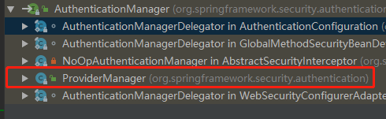
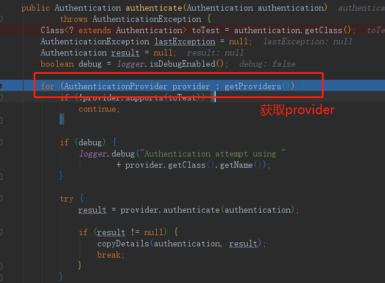
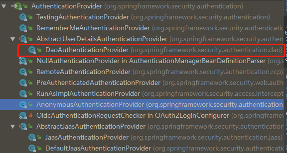
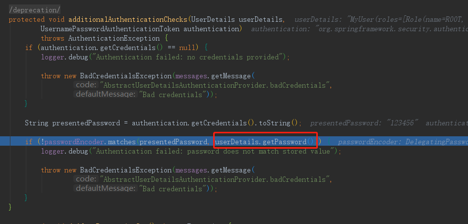
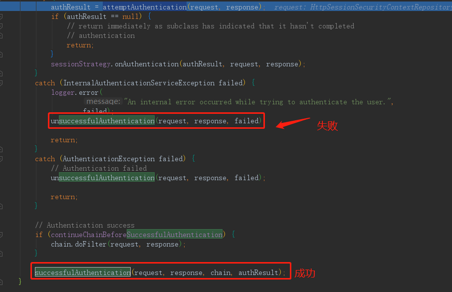
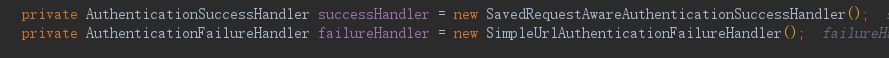
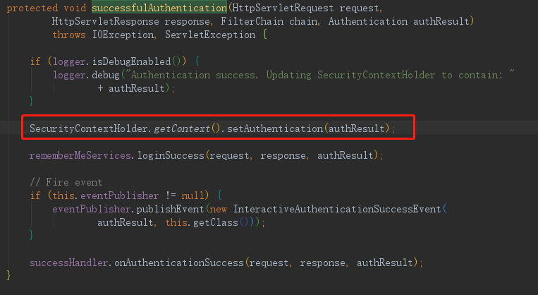
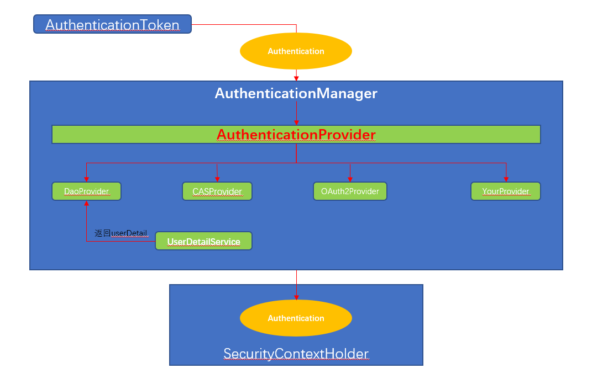

#
## 主要类的功能概述
* `AuthenticationToken`: 所有请求都会封装成AuthenticationToken,再交给`AuthenticationManager`去验证,核心实现就是`UsernamePasswordAuthenticationToken`.
* `AuthenticationManager` :这个接口是所有认证管理的中心,所有的请求都会将请求信息封装为Authentication的实现类，再经过它的`authenticate(Authentication authentication)`方法进行认证或者授权，返回一个经过认证或者授权的Authentication对象.他有许多实现,最重要一个核心实现就是`ProviderManager`(图1),最后调用这个实现类的`authenticate()`方法(图2).这个方法的主要内容是调用`AuthenticationProvider`进行验证和授权.

 

 

* `AuthenticationProvider` :AuthenticationManager的authenticate方法最终调用的就是`AuthenticationProvider`的`authenticate()`的方法，当然这个也是非常的spring(为你提供了各种各样的实现),我们最重要的当然是基于数据库(图3)的验证方式，也就是`DaoAuthenticationProvider`,這也是默认的验证方式.


* `UserDetailsService` : 这个接口主要定义`loadUserByUsername(String name)`方法,也就是根据用户名从数据库中查询用户,所以需要用户提供自己的实现.`AuthenticationProvider`验证的核心原理就是:从UserDetailsService中查询数据库中用户的密码，再和用户登录的密码比较,如果匹配就说明验证成功，也就是`additionalAuthenticationChecks(UserDetails userDetails,UsernamePasswordAuthenticationToken authentication)`方法(图4).

* `AuthenticationSuccessHandler`和`AuthenticationFailureHandler`:验证/认证成功和失败都是通过Handler来处理(图5、图5-1),这个比较简单.一般我们在验证成功以后生成token,认证成功以后返回成功标识即可。在`AbstractAuthenticationProcessingFilter`中处理失败和成功。





*  `SecurityContext`:当所有的验证成功以后,返回一个Authentication,这个就是用户的回话上下文，我们需要一个容器把他保存起来，这个时候就是`SecurityContext`来做,SecurityHolder.getSecruityContext()就可以得到用户信息.




## 主要流程概述
springsecurity主要有两个功能:
- 验证：即Authenrization,主要解决"你是谁",也就是登录的时候验证你的合法性、记录用户的权限信息,验证通过后返回token.
- 认证：即Authentication,主要解决"你能做什么",用户拿着token去请求除了登录退出之外的其他资源是否有相应的权限控制.

所以基本上本demo就是围绕这两个核心的流程展开的
## 新建jwt工具类，加密解密jwt,此处略
## 新建用户、角色、权限表,以及中间表
注意：用户表要实现`UserDetails` ,角色表要实现`GrantedAuthority`

* 用户表

```java
@Data
@Entity
@Table(name = "user")
@ToString
public class MyUser extends BaseEntity implements UserDetails {
    /**
     *  @JoinTable：name-中间表的名字
     *  JoinColumn:当前表的referencedColumnName的字段（id）在中间表的字段名字（user_id）
     *  inverseJoinColumns: 关联外键表的referencedColumnName的字段（id）在中间表的字段名字（role_id）
     */
    @ManyToMany(cascade = CascadeType.ALL, fetch = FetchType.LAZY)
    @JoinTable(name = "user_role", joinColumns = @JoinColumn(name = "user_id", referencedColumnName = "id"), inverseJoinColumns = @JoinColumn(name = "role_id", referencedColumnName = "id"))
    private List<Role> roles;

    @Column(unique = true, length = 32, columnDefinition = "varchar(32)  DEFAULT '' COMMENT '用户名'")
    private String username;

    @Column(length = 50, columnDefinition = " varchar(50) DEFAULT '' COMMENT '密码'")
    private String password;

    @Override
    public String getPassword() {
        return password;
    }

    @Override
    public String getUsername() {
        return username;
    }

    /**
     * 获取权限列表
     * @return
     */
    @Override
    public Collection<? extends GrantedAuthority> getAuthorities() {
        return  roles;
    }

    @Override
    public boolean isAccountNonExpired() {
        return true;
    }

    @Override
    public boolean isAccountNonLocked() {
        return true;
    }

    @Override
    public boolean isCredentialsNonExpired() {
        return true;
    }

    @Override
    public boolean isEnabled() {
        return true;
    }
}
```

* 角色表

```java
@Data
@Entity
public class Role extends BaseEntity implements GrantedAuthority{
    @Column(length = 64, columnDefinition = "varchar(64) default '' COMMENT '角色名称/菜单名'")
    private String name;

    @Override
    public String getAuthority() {
        return name;
    }

    @ManyToMany(cascade = CascadeType.ALL, fetch = FetchType.LAZY)
    @JoinTable(name = "role_permission", joinColumns = @JoinColumn(name = "role_id", referencedColumnName = "id"), inverseJoinColumns = @JoinColumn(name = "permit_id", referencedColumnName = "id"))
    private List<Permission> permissions;

    @Column(length = 1024, columnDefinition = "varchar(1024) default '' COMMENT '内容'")
    private String descpt;
    @Column(length = 64, columnDefinition = "varchar(64) default '' COMMENT '角色编号'")
    private String code;
    @Column(length = 10, columnDefinition = "int(10) COMMENT '插入者id'")
    private  Integer insertUid;

}
```

* 权限表

```java
@Data
@Entity
public class Permission  extends  BaseEntity{
    @Column(columnDefinition = "varchar(64) default '' COMMENT '权限名称'")
    private String name;

    /*@ManyToMany(mappedBy = "permissions")
    private List<Role> roles;*/

    @Column(length = 10, columnDefinition = "int(10) COMMENT '父菜单id'")
    private Integer pid;
    @Column(length = 10, columnDefinition = "int(10) COMMENT '菜单排序'")
    private Integer zindex;


    @Column(length = 1, columnDefinition = "int(1) COMMENT '权限分类（0 菜单；1 功能）'")
    private Integer istype;
    @Column(length = 64, columnDefinition = "varchar(64) default '' COMMENT '权限描述'")
    private String descpt;
    @Column(length = 64, columnDefinition = "varchar(64) default '' COMMENT '图标'")
    private String icon;
    @Column(length = 64, columnDefinition = "varchar(64) default '' COMMENT '代号'")
    private String code;
    @Column(length = 64, columnDefinition = "varchar(64) default '' COMMENT '菜单url'")
    private String page;
}
```
## 实现UserDetailsService
```java
@Service
public class JwtUserService implements UserDetailsService {
    private  static  Logger LOGGER = LoggerFactory.getLogger(JwtUserService.class);
    @Autowired
    UserDao userDao;

    @Autowired
    private PasswordEncoder passwordEncoder;
    /**
     * 从数据库中查询用户，密码应该是数据库加密的密码，但是这里和登录的时候一致，使用写死的密码
     * @param username
     * @return
     * @throws UsernameNotFoundException
     */
    @Override
    public UserDetails loadUserByUsername(String username) throws UsernameNotFoundException {
        MyUser user = new UserDao().findUserByUsername(username);
        String password = passwordEncoder.encode("123456");
        user.setPassword(password);
        LOGGER.info("查询到用户信息:{}",user.toString());
        return user;
    }
    /**
     * 用户注册
     * @param user
     */
    public  void regisUser(MyUser user){

    }

    public void deleteUserJwt(){

    }
```

## 验证
### 新建JwtAuthenticationFilter类继承`UsernamePasswordAuthenticationFilter`,这个过滤器拦截"/login"路径(其实这个是默认的，写出来方便看而已),拦截后生成`AuthenticationToken`交给`AuthenticationManager`去验证,验证成功就生成jwt返回给发起者.
```java
public class JwtAuthenticationFilter extends UsernamePasswordAuthenticationFilter {


    private  static  Logger LOGGER = LoggerFactory.getLogger(JwtAuthenticationFilter.class);


    private AuthenticationManager authenticationManager;

    /**
     * 在构造器中设置拦截的路劲,默认拦截的是"/login"
     * 在构造器中设置AuthenticationManager
     */
    public JwtAuthenticationFilter(AuthenticationManager authenticationManager){
        super.setRequiresAuthenticationRequestMatcher(new AntPathRequestMatcher("/login", "POST"));
        this.authenticationManager=authenticationManager;
    }

    @Override
    public Authentication attemptAuthentication(HttpServletRequest request, HttpServletResponse response) throws AuthenticationException {
        //从json中获取username和password
        UsernamePasswordAuthenticationToken token = null;
        try {
            String body = StreamUtils.copyToString(request.getInputStream(), Charset.forName("UTF-8"));
            String username = null, password = null;
            if (StringUtils.hasText(body)) {
                JSONObject jsonObj = JSONObject.parseObject(body);
                username = jsonObj.getString("username");
                password = jsonObj.getString("password");
            }
            if (username == null){
                username = "";
            }
            if (password == null){
                password = "";
            }
            username = username.trim();
            token = new UsernamePasswordAuthenticationToken(username,password);
            LOGGER.info("get user info from login success,name:{}",token.getName());
        } catch (IOException e) {
            LOGGER.error("get user info from login failed，reason:{}",e.getMessage());
        }
        //封装后的token最终是交给provider来处理
        Authentication authenticate = authenticationManager.authenticate(token);
        return authenticate;
    }

    /**
     * 验证成功之后的回调,可以自己实现AuthenticationSuccessHandler处理(JwtLoginSuccessHandler)
     * @param request
     * @param response
     * @param chain
     * @param authResult
     * @throws IOException
     * @throws ServletException
     */
    @Override
    protected void successfulAuthentication(HttpServletRequest request, HttpServletResponse response, FilterChain chain, Authentication authResult) throws IOException, ServletException {
        MyUser user= (MyUser) authResult.getPrincipal();
        String jwt = JwtTokenUtils.createToken(user);
        StringBuffer buffer = new StringBuffer(CommonConst.TOKEN_PREFIX);
        buffer.append(jwt);
        LOGGER.info("authentication success,user:【{}】,jwt:【{}】",user.toString(),buffer.toString());
        response.setHeader(CommonConst.JWTHEADER, buffer.toString());
    }

    /**
     * 验证失败之后的回调，可以自己实现AuthenticationFailureHandler处理(JwtLoginFailureHandler)
     * @param request
     * @param response
     * @param failed
     * @throws IOException
     * @throws ServletException
     */
    @Override
    protected void unsuccessfulAuthentication(HttpServletRequest request, HttpServletResponse response, AuthenticationException failed) throws IOException, ServletException {
        String message = failed.getCause().getMessage();
        LOGGER.error("authentication failed, reason:{}",message);
        response.setStatus(HttpStatus.UNAUTHORIZED.value());
    }
}
```


## 认证
### 新建JwtAuthenrizationFilter继承`BasicAuthenticationFilter`,取出用户的jwt,解密jwt
```java
public class JwtAuthenrizationFilter extends BasicAuthenticationFilter {
    Logger LOGGER = LoggerFactory.getLogger(JwtAuthenrizationFilter.class);

    @Autowired
    JwtUserService userService;

    public JwtAuthenrizationFilter(AuthenticationManager authenticationManager) {
        super(authenticationManager);
    }

    /**
     * @param tokenHeader
     * @return
     */
    protected UsernamePasswordAuthenticationToken getToken(String tokenHeader) {
        LOGGER.info("Authenrization jwt:{}",tokenHeader);
        String token = tokenHeader.replace(CommonConst.TOKEN_PREFIX, "");
        String name = JwtTokenUtils.getUserNameByToken(token);
        LOGGER.info("Authenrization username:{}",name);
        UserDetails userDetails = userService.loadUserByUsername(name);
        Collection<? extends GrantedAuthority> authorities = userDetails.getAuthorities();
        UsernamePasswordAuthenticationToken passwordAuthenticationToken = new UsernamePasswordAuthenticationToken(name, null, userDetails.getAuthorities());
        return passwordAuthenticationToken;
    }

    @Override
    protected void doFilterInternal(HttpServletRequest request, HttpServletResponse response, FilterChain chain) throws IOException, ServletException {
        String tokenHeader = request.getHeader(CommonConst.JWTHEADER);
        // 如果请求头中没有Authorization信息则直接放行了
        if (tokenHeader == null || !tokenHeader.startsWith(CommonConst.TOKEN_PREFIX)) {
            chain.doFilter(request, response);
            return;
        }
        //有jwt则需要验证
        UsernamePasswordAuthenticationToken authenticationToken = getToken(tokenHeader);
        //剩下的就交给authenticationManager、provider去做
        SecurityContextHolder.getContext().setAuthentication(authenticationToken);
        super.doFilterInternal(request, response, chain);
    }
}

```
## 统一配置
  以上是主要类的建立，下面我们需要加载这些配置，使得他们可以生效.新建SecurityConfig继承`WebSecurityConfigurerAdapter`
- 配置拦截路劲，也就是antMatchers()方法，默认的登录“/login”和退出"/logout"是不需要配置的;另外可以配置路径具有哪些权限
- 跨域配置
* 加入验证和认证的filter,也就是`JwtAuthenticationFilter`和`JwtAuthenrizationFilter`

```java
@Configuration
@EnableWebSecurity
//@EnableGlobalMethodSecurity(prePostEnabled = true)开启方法级别的安全注解
public class SecurityConfig  extends WebSecurityConfigurerAdapter {

    @Autowired
    @Qualifier("jwtUserService")
    private UserDetailsService userDetailsService;

    /**
     * 注入加密
     * @return
     */
    @Bean
    public static PasswordEncoder passwordEncoder() {
        return PasswordEncoderFactories.createDelegatingPasswordEncoder();
    }

    @Override
    protected void configure(AuthenticationManagerBuilder auth) throws Exception {
        //在这里指定密码的加密方式，SpringSecutity5.0之后必须指定
        auth.userDetailsService(userDetailsService).passwordEncoder(passwordEncoder());
        //auth.authenticationProvider(authenticationProvider());
       /* auth.inMemoryAuthentication() //认证信息存储到内存中
                .passwordEncoder(passwordEncoder())
                .withUser("zhouyu").password(passwordEncoder().encode("123456")).roles("ADMIN");*/
    }

    /**
     * 默认使用的就是DaoAuthenticationProvider,在这里只是显示的写出来参考
     * @param http
     * @throws Exception
     */
   /* @Bean
    public DaoAuthenticationProvider authenticationProvider() {
        DaoAuthenticationProvider authenticationProvider = new DaoAuthenticationProvider();
        authenticationProvider.setUserDetailsService(userDetailsService);
        authenticationProvider.setPasswordEncoder(passwordEncoder());
        return authenticationProvider;
    }*/

    @Override
    protected void configure(HttpSecurity http) throws Exception {
        http.authorizeRequests()
                .antMatchers("/image/**").permitAll()
                .antMatchers("/admin/**").hasAnyRole("ADMIN")
                .antMatchers("/article/**").hasRole("USER")
                .anyRequest().authenticated()
                .and()
                .csrf().disable()
                //.formLogin().disable()
                //不需要session
                .sessionManagement().disable()
                //跨域允许
                .cors()
                .and()
                .headers().addHeaderWriter(new StaticHeadersWriter(Arrays.asList(
                new Header("Access-control-Allow-Origin","*"),
                new Header("Access-Control-Expose-Headers","Authorization"))))
                .and()
                .addFilter(new JwtAuthenticationFilter(authenticationManager()))
                .addFilter(new JwtAuthenrizationFilter(authenticationManager()))
                .logout()
                .addLogoutHandler(new JwtLogoutHandler())
                .logoutSuccessHandler(new HttpStatusReturningLogoutSuccessHandler())
                .and()
                .sessionManagement().disable();
    }

    /**
     * 跨域配置
     * @return
     */
    @Bean
    protected CorsConfigurationSource corsConfigurationSource() {
        CorsConfiguration corsConfiguration = new CorsConfiguration();
        corsConfiguration.addAllowedOrigin("*");
        corsConfiguration.addAllowedHeader("*");
        corsConfiguration.addAllowedMethod("*");
        corsConfiguration.addExposedHeader("Authorization");
        UrlBasedCorsConfigurationSource source = new UrlBasedCorsConfigurationSource();
        source.registerCorsConfiguration("/**", corsConfiguration);
        return source;
    }
}
```
## postman模拟测试
使用postman发出login请求,后台会返回一个jwt,我们在拿着jwt去访问首页index,验证通过会有日志显示

现在已经完成了验证和授权的全部，细心的你可能发现了,现实的权限管理是动态的:用户访问一个url,我们需要根据用户的权限来判断用户是否具有访问的权限.我们将在[下一篇](sd)中介绍动态的权限管理如何实现.
