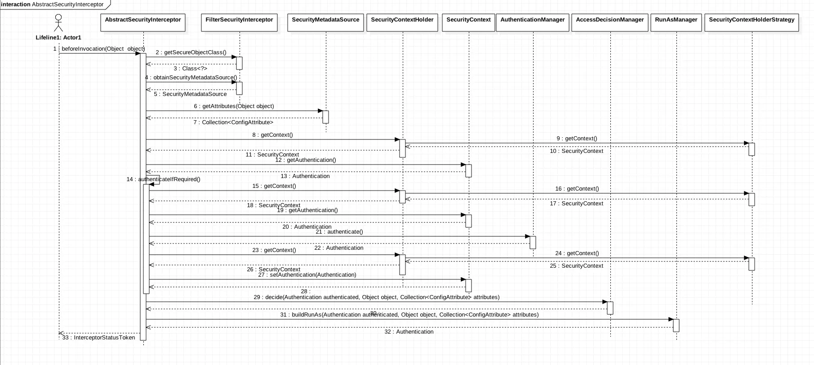
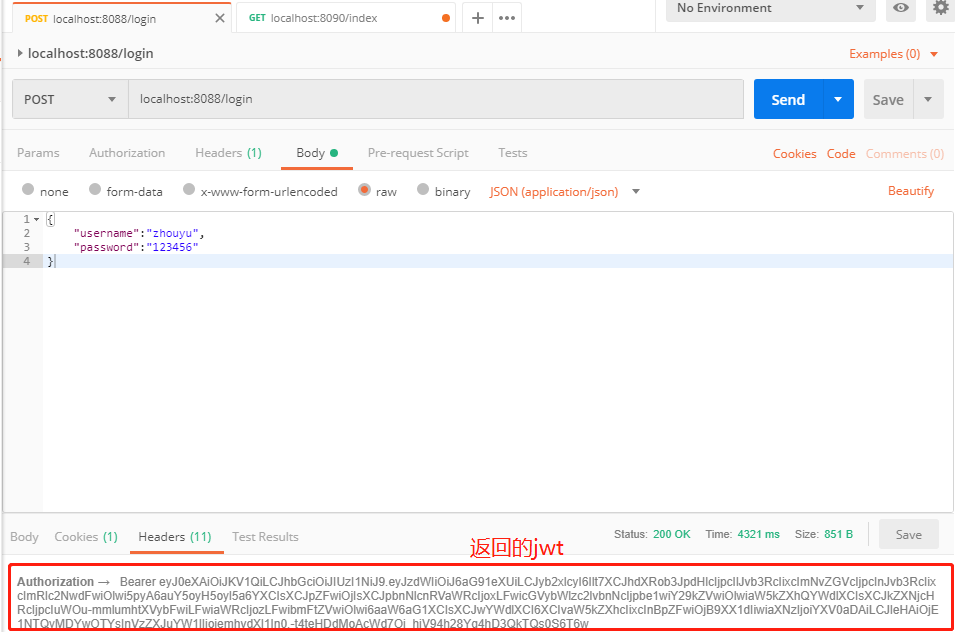
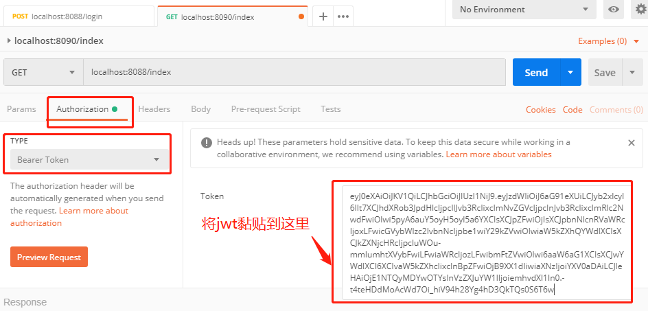
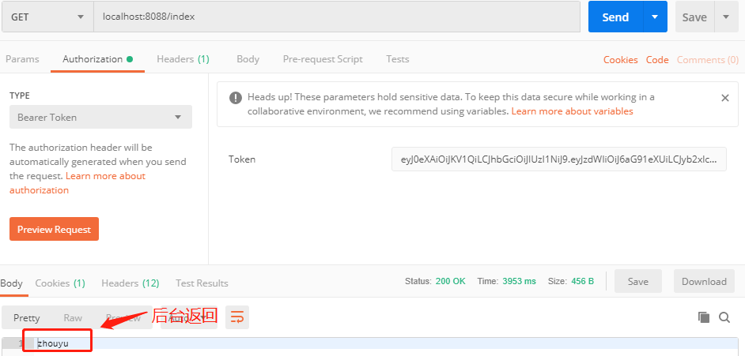

# 在这里我们将实现动态的权限管理

## 重要类与方法流程概述



- AbstractSecurityInterceptor 
  - beforeInvocation(Object object)方法,这个是验证的核心
  1.从SecurityMetadataSource中获得ConfigAttribute列表,这个列表一般是角色的集合
  2.使用AccessDecisionManager的decide()方法决定是否有权限
    ```java
    protected InterceptorStatusToken beforeInvocation(Object object) {
            Assert.notNull(object, "Object was null");
            final boolean debug = logger.isDebugEnabled();

            if (!getSecureObjectClass().isAssignableFrom(object.getClass())) {
                throw new IllegalArgumentException(
                        "Security invocation attempted for object "
                                + object.getClass().getName()
                                + " but AbstractSecurityInterceptor only configured to support secure objects of type: "
                                + getSecureObjectClass());
            }
            //1.在这里我们将通过SecurityMetadataSource获取ConfigAttribute集合,一般这个集合我们存放的是角色集合
            Collection<ConfigAttribute> attributes = this.obtainSecurityMetadataSource()
                    .getAttributes(object);

            if (attributes == null || attributes.isEmpty()) {
                if (rejectPublicInvocations) {
                    throw new IllegalArgumentException(
                            "Secure object invocation "
                                    + object
                                    + " was denied as public invocations are not allowed via this interceptor. "
                                    + "This indicates a configuration error because the "
                                    + "rejectPublicInvocations property is set to 'true'");
                }

                if (debug) {
                    logger.debug("Public object - authentication not attempted");
                }

                publishEvent(new PublicInvocationEvent(object));

                return null; // no further work post-invocation
            }

            if (debug) {
                logger.debug("Secure object: " + object + "; Attributes: " + attributes);
            }

            if (SecurityContextHolder.getContext().getAuthentication() == null) {
                credentialsNotFound(messages.getMessage(
                        "AbstractSecurityInterceptor.authenticationNotFound",
                        "An Authentication object was not found in the SecurityContext"),
                        object, attributes);
            }

             //2.验证
            Authentication authenticated = authenticateIfRequired();

            // Attempt authorization
            try {
                //3.通过AccessDecisionManager来决定用户访问的url是否拥有相应的权限
                this.accessDecisionManager.decide(authenticated, object, attributes);
            }
            catch (AccessDeniedException accessDeniedException) {
                publishEvent(new AuthorizationFailureEvent(object, attributes, authenticated,
                        accessDeniedException));

                throw accessDeniedException;
            }

            if (debug) {
                logger.debug("Authorization successful");
            }

            if (publishAuthorizationSuccess) {
                publishEvent(new AuthorizedEvent(object, attributes, authenticated));
            }

            // Attempt to run as a different user
            Authentication runAs = this.runAsManager.buildRunAs(authenticated, object,
                    attributes);

            if (runAs == null) {
                if (debug) {
                    logger.debug("RunAsManager did not change Authentication object");
                }

                // no further work post-invocation
                return new InterceptorStatusToken(SecurityContextHolder.getContext(), false,
                        attributes, object);
            }
            else {
                if (debug) {
                    logger.debug("Switching to RunAs Authentication: " + runAs);
                }

                SecurityContext origCtx = SecurityContextHolder.getContext();
                SecurityContextHolder.setContext(SecurityContextHolder.createEmptyContext());
                SecurityContextHolder.getContext().setAuthentication(runAs);

                // need to revert to token.Authenticated post-invocation
                return new InterceptorStatusToken(origCtx, true, attributes, object);
            }
        }
    ```

- SecurityMetadataSource接口
  - getAllConfigAttributes(),拦截所有的请求url,可以在这里设置不拦截的url,然后根据url查询角色放入ConfigAttributes列表.

- AccessDecisionManager
  - decide(Authentication authentication, Object object, Collection<ConfigAttribute> configAttributes),根据SecurityMetadataSource返回的角色列表和用户authentication中的角色比较，包含则验证通过

## 自定义SecurityMetadataSource实现
```java
@Component
public class MyFilterInvocationSecurityMetadataSource implements FilterInvocationSecurityMetadataSource {

    private static Logger logger = LoggerFactory.getLogger(MyFilterInvocationSecurityMetadataSource.class);
    private  List<ConfigAttribute> configAttributes = new ArrayList<>();

    @Autowired
    PermissionService permissionService;

    @Autowired
    RoleDao roleDao;

    private PathMatcher matcher = new AntPathMatcher();

    @Value("${security.ignoring}")
    private String ignoreUrl;

    @Override
    public Collection<ConfigAttribute> getAttributes(Object object) throws IllegalArgumentException {
        try {
            FilterInvocation fi = (FilterInvocation) object;
            logger.info("动态拦截url:{}",fi.getRequestUrl());
            String requestUrl = fi.getRequestUrl();

            //在这里可以配置不拦截的url
            List<String> ignoreUrls = getIgnoreUrl();
            for (String ignoreUrl : ignoreUrls) {
                if(matcher.match(ignoreUrl,requestUrl)){
                    ConfigAttribute attribute = new SecurityConfig(CommonConst.ANONYMOUS);
                    configAttributes.add(attribute);
                    return configAttributes;
                }
            }
            //如果没有改资源就保存
            MyPermission permission = permissionService.getPermission(fi.getRequestUrl());
            List<BigInteger> roleIds = roleDao.findAllByPermissionId(permission.getId());
            ArrayList<Long> ids = new ArrayList<>();
            for (BigInteger roleId : roleIds) {
                ids.add(roleId.longValue());
            }
            Iterable<Role> roles = roleDao.findAllById(ids);
            roles.forEach(role -> {
                ConfigAttribute conf = new SecurityConfig(role.getAuthority());
                configAttributes.add(conf);
            });
        } catch (Exception e) {
           logger.error("拦截url获取权限失败,reason:{},线程:{}",e.getStackTrace(),Thread.currentThread().getName());
        }
        return configAttributes;
    }

    /**
     * 获取忽略的url
     * @return
     */
    private List<String> getIgnoreUrl(){
        String[] split = ignoreUrl.split(",");
        List<String> ignoreUrls = Arrays.asList(split);
        return  ignoreUrls;
    }

    @Override
    public Collection<ConfigAttribute> getAllConfigAttributes() {
        return configAttributes;
    }

    @Override
    public boolean supports(Class<?> clazz) {
        return true;
    }
}

```

##自定义实现AccessDecisionManager
```java
@Component
public class MyAccessDecisionManager implements AccessDecisionManager {

    private static Logger logger = LoggerFactory.getLogger(MyAccessDecisionManager.class);

    @Override
    public void decide(Authentication authentication, Object object, Collection<ConfigAttribute> configAttributes) throws AccessDeniedException, InsufficientAuthenticationException {
        if(CollectionUtils.isEmpty(configAttributes)){
            logger.warn("AccessDecision your configAttributes is empty");
            throw new AccessDeniedException("configAttributes empty");
        }
        for (ConfigAttribute configAttribute: configAttributes) {
            //获取角色
            String role = configAttribute.getAttribute();
            Collection<? extends GrantedAuthority> authorities = authentication.getAuthorities();
            for (GrantedAuthority authority:authorities) {
                if(authority.getAuthority().equals(role)||authentication.equals(CommonConst.ANONYMOUS)){
                    logger.info("匹配到相应的权限,role:{}",role);
                    return;
                }
            }
        }
        //登录用户没有匹配到对应权限,则禁止访问
        throw new AccessDeniedException("not allow");
    }

    @Override
    public boolean supports(ConfigAttribute attribute) {
        return true;
    }

    @Override
    public boolean supports(Class<?> clazz) {
        return true;
    }

```

## 将动态权限管理加入配置中
```java
public class SecurityConfig  extends WebSecurityConfigurerAdapter {


    @Autowired
    @Qualifier("jwtUserService")
    private UserDetailsService userDetailsService;

    @Autowired
    private FilterInvocationSecurityMetadataSource myFilterInvocationSecurityMetadataSource;

    @Autowired
    private AccessDecisionManager myAccessDecisionManager;


    @Override
        protected void configure(HttpSecurity http) throws Exception {
            http.authorizeRequests()
                    .antMatchers("/image/**").permitAll()
                    .antMatchers("/admin/**").hasAnyRole("ADMIN")
                    .antMatchers("/article/**").hasRole("USER")
                    .anyRequest().authenticated()
                    .and()
                    .csrf().disable()
                    //.formLogin().disable()
                    //不需要session
                    .sessionManagement().disable()
                    //跨域允许
                    .cors()
                    .and()
                    .headers().addHeaderWriter(new StaticHeadersWriter(Arrays.asList(
                    new Header("Access-control-Allow-Origin","*"),
                    new Header("Access-Control-Expose-Headers","Authorization"))))
                    .and()
                    //验证
                    .addFilter(new JwtAuthenticationFilter(authenticationManager()))
                    //认证
                    .addFilter(new JwtAuthenrizationFilter(authenticationManager()))
                    .logout()
                    .addLogoutHandler(new JwtLogoutHandler())
                    .logoutSuccessHandler(new HttpStatusReturningLogoutSuccessHandler())
                    .and()
                    .sessionManagement().disable()
                    //添加自定义的拦截器,实现动态的权限管理,注意addFilterAt()方法会在相同位置添加拦截器，会导致拦截两次
                    //.addFilterAt(getMySecurityInterceptor(), FilterSecurityInterceptor.class)
                    .authorizeRequests()
                    .accessDecisionManager(myAccessDecisionManager)
                    .withObjectPostProcessor(new ObjectPostProcessor<FilterSecurityInterceptor>() {
                        @Override
                        public <O extends FilterSecurityInterceptor> O postProcess(
                                O fsi) {
                            fsi.setSecurityMetadataSource(myFilterInvocationSecurityMetadataSource);
                            return fsi;
                        }
                    });

        }

        ...
}

```
## 测试

### 新建一个controller

```java
@RestController
public class UserLoginController {
   private static Logger logger = LoggerFactory.getLogger(UserLoginController.class);

    @RequestMapping("/login")
    public String userLogin(@RequestBody MyUser user){
        logger.info("login,user:{}",user.toString());
        return "zhouyu";
    }

    @RequestMapping("/index")
    @ResponseBody
    public String gotoIndexPage(){
        logger.info("去首页");
        return "zhouyu";
    }
}
```

### postman模拟登录
发出登录请求后后台返回一个jwt


### postman模拟去首页
得到jwt后拿着它去访问首页,验证通过,后台返回结果.




## 采坑记
### springsecurity中的filter有严格的过滤顺序,在`FilterComparator`中定义了各个顺序.在配置`WebSecurityConfigurerAdapter`时候加入自定义的filter有三个方法
- addFilterBefore(Filter filter, Class beforeFilter) 在 beforeFilter 之前添加 filter
- addFilterAfter(Filter filter, Class afterFilter) 在 afterFilter 之后添加 filter
- addFilterAt(Filter filter, Class atFilter) 在 atFilter 相同位置添加 filter， 此 filter 不覆盖 filter

这几个方法来确保自定义的filter加入顺序
    在进行动态授权的过程中，我按照网上的demo自定义了一个AbstractSecurityInterceptor实现类，最后使用`.addFilterAt(getMySecurityInterceptor(), FilterSecurityInterceptor.class)`加入这个拦截器，最后发现拦截了两次,因为这个方法不能覆盖后面的filter.后来使用以下方式注入自己的`DecisionManager`和`SecurityMetadataSource`

```java
    .accessDecisionManager(myAccessDecisionManager)
                    .withObjectPostProcessor(new ObjectPostProcessor<FilterSecurityInterceptor>() {
                        @Override
                        public <O extends FilterSecurityInterceptor> O postProcess(
                                O fsi) {
                            fsi.setSecurityMetadataSource(myFilterInvocationSecurityMetadataSource);
                            return fsi;
                        }
                    });
```
   
### `/login`访问后无法跳转到`login.html`页面
springsecurity配置的登录页面是 `login.html`,而springboot默认访问的静态页面是在classpath下的四个目录中
- static 
- public
- resources
- META-INFO/resource

但是,`templates`中的文件是需要通过视图解析器才能访问